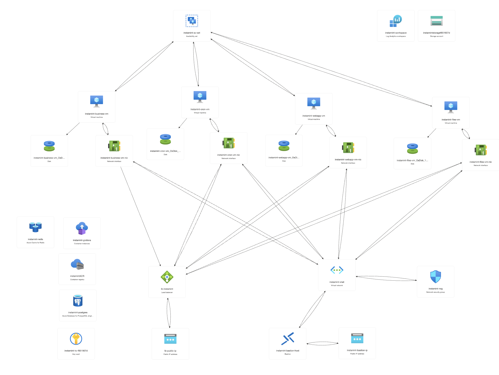

# 💠 Terraform

> Terraform is an open-source infrastructure as code software tool created by HashiCorp. It enables users to define and
> provision a data center infrastructure using a high-level configuration language known as HashiCorp Configuration
> Language (HCL), or optionally JSON.

## 📚 Ressources

- [📖 Terraform](https://learn.hashicorp.com/tutorials/terraform/install-cli)
- [📖 Azure CLI](https://docs.microsoft.com/en-us/cli/azure/install-azure-cli)
- [📖 Azure Subscription](https://portal.azure.com/)

## ⚠️ Requirements

- Install [Terraform](https://learn.hashicorp.com/tutorials/terraform/install-cli) | [Azure CLI](https://docs.microsoft.com/en-us/cli/azure/install-azure-cli) | [TFLint](https://github.com/terraform-linters/tflint)
  🚀
- Login to Azure CLI:
  - `az login`
  - `az account set --subscription {subscription_id}`
  - `az account show`
- Create ssh key pair:
  - `ssh-keygen -t rsa -b 2048 -f ~/.ssh/azure`
- Setup `secrets.tfvars` with the following content:

  ```hcl
  # VM
  admin_username      = "" # Azure admin username
  admin_password      = "" # Azure admin password

  # PostgreSQL
  psql_login          = "" # Postgres login
  psql_password       = "" # Postgres password
  database_name       = "" # Postgres database name

  # Grafana
  grafana_password    = "" # Grafana password

  # Azure
  client_object_id    = "" # Azure client object id > az ad sp list --display-name instamint-prod-sp

  # ACR
  acr_username        = "" # Azure Container Registry username
  acr_password        = "" # Azure Container Registry password

  # SSH Keys
  ssh_public_key      = "~/.ssh/azure.pub" # Azure ssh public key

  # Network
  ssh_allowed_ip      = "" # Azure ssh allowed ip(s) ! If you want to switch to an array change the variable type in the vars.tf file at root level

  ### ENVIRONMENT VARIABLES ###

  security_cookie_secret=""
  security_jwt_secret=""
  security_password_pepper= ""

  ## Sentry
  sentry_dsn=""

  ## SendGrid
  sendgrid_api_key="SG."
  sendgrid_sender=""
  sendgrid_template_email_validation="d-"
  sendgrid_template_reset_password="d-"
  sendgrid_template_confirm_reset_password="d-"
  sendgrid_template_confirm_account_deletion="d-"
  sendgrid_template_account_reactivation="d-"
  sendgrid_template_account_confirm_reactivation="d-"
  sendgrid_template_modify_password="d-"

  ## Cron Jobs
  security_cron_jwt_secret=""
  security_cron_jwt_scope_delete_account=""
  ```

## 🧩 Commands

- `terraform init`: Initialize the terraform configuration.
- `terraform validate`: Validate the terraform configuration.
- `terraform plan -out=plan.out`: Plan the terraform configuration and save it to a file.
- `terraform apply plan.out` or `terraform apply -var-file="secrets.tfvars"`: Apply the terraform configuration from
  the plan file or with a secrets file.
- `terraform destroy`: Destroy the terraform configuration.
- `terraform output`: Show the terraform outputs.
- `terraform show`: Show the terraform state.
- `terraform state list`: List the terraform state.
- `terraform import {resource_type}.{resource_name} {resource_id}`: Import a resource into the terraform state.
- `terraform refresh`: Refresh the terraform state.

## 🔰 Architecture

- `root`:
  - `main.tf`: Main terraform configuration to imports other modules.
  - `vars.tf`: Variables definition.
  - `secrets.tfvars`: Secrets variables definition.
- `modules`:
  - `analytics`: Analytics module to create the analytics resources to monitor the VMs.
  - `bastion`: Bastion module to create the bastion resources to access the VMs.
  - `db`: Database module to create Postgres & Redis resources.
  - `network`: Network module to create the network resources like VNET, Subnets etc.
  - `vm`: VM module to create the VM resources.
  - `acr`: ACR module to create the Azure Container Registry resources to push the docker images.
  - `blob`: Blob module to create the Azure Blob Storage resources.
  - `security`: Security module to create the security resources like NSG, Security Groups etc.
  - `nic`: NIC module to create the Network Interface Card resources.
  - `kv`: KeyVault module to create the KeyVault resources.
  - `grafana`: Grafana module to create the Grafana resources to watch the metrics.
  - `utils`: Utils module to create the utils resources like random strings etc.

## 🤖 Azure CLI Commands

- ### 🛡️ **Bastion**

  #### 🔨 Azure SSH Tunneling

  - Add the ssh extension to the Azure CLI:

  ```shell
  az extension add -n ssh
  ```

  - Create ssh tunnel to the bastion:

  ```shell
  az network bastion ssh --name {bastion} --resource-group {ressourceGroup} --target-ip-address {privateIp} --auth-type "ssh-key" --username {vmUsername} --ssh-key "~/.ssh/azure"
  ```

  #### 🔨 Local SSH Tunneling

  - Create ssh tunnel to the VM to access it locally:

  ```shell
  az network bastion tunnel --name {bastion} --resource-group {ressourceGroup} --target-resource-id /subscriptions/{subscriptionId}/resourceGroups/{ressourceGroup}/providers/Microsoft.Compute/virtualMachines/{vmName} --resource-port 22 --port {localPort}
  ```

  - Connect to the VM locally:

  ```shell
  ssh -p {localPort} {vmUsername}@localhost
  ```

## ⚙️ Linter

- To lint the terraform code, run the following command:

```sh
tflint --recursive --config "$(pwd)/.tflint.hcl"
```

#### 📚 Tunelling Doc

- [📖 Terraform x Azure Bastion x Tunneling Setup](https://dev.to/holger/test-azure-bastion-deployment-via-terraform-18o8)

### 📸 Infra Schema


