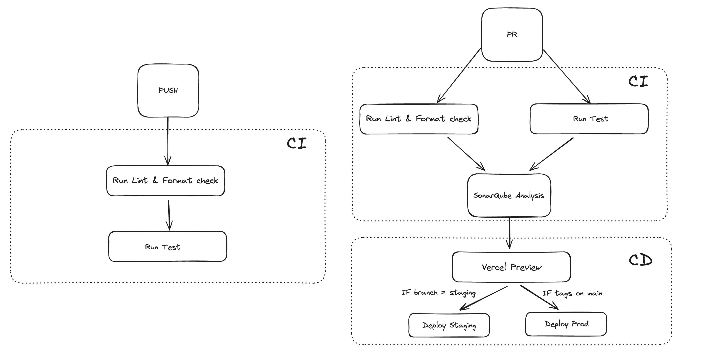

# 🤖 GitHub Actions

#### We use Github Actions to ensure continuous integration and deployment processes.

## 📝 Our needs

- **Linting**: Check the code quality and ensure that it follows the coding standards.
- **Formatting**: Format the code to ensure that it is consistent and easy to read.
- **Testing**: Run the tests to ensure that the code works as expected.
- **Deployment**: And finally to deploy the code to the server after the tests pass.

## 🚀 How it works

In a specific directory `.github/workflows`, we have all YAML files that define the workflows for **GitHub Actions**.

#### 💡 Our workflows schema is as follows:

