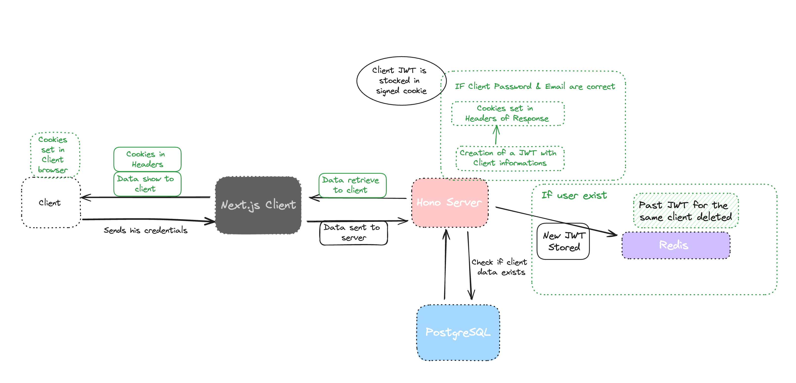

# 🍪 Cookies - HonoJS

> We're going to show you how to manage cookies on Instamint using our Hono Back-end.

## 📚 Resources

- [📖 HonoJS - Cookie](https://hono.dev/helpers/cookie)
- [📖 HonoJS - CORS](https://hono.dev/middleware/builtin/cors)
- [📖 HonoJS - Middleware](https://hono.dev/guides/middleware)
- [📖 HonoJS - Request](https://hono.dev/api/request#header)
- [📖 DataTracker - Cookie](https://datatracker.ietf.org/doc/html/draft-ietf-httpbis-rfc6265bis-13)

## 💡 How to use cookies

### ⚙️ Configuration

- ⚠️ **Back-end**: Custom your CORS configuration in the `root` file of your server:

```ts
import { Hono } from "hono"
import { cors } from "hono/cors"

const server = async (appConfig) => {
  /* ... */
  const app = new Hono()
  app.use(
    "*",
    cors({
      origin: "your-origin", // Default = *, example: https://example.com
      credentials: true, // Default = false, necessary for cookies
    }),
    secureHeaders()
  )

  /* ... */

  return app
}

export default server
```

- ⚠️ **Front-end**: Custom your fetcher configuration of your client:

You can use the `axios` package to create an API client:

```ts
export const createApiClient = ({ baseURL }) => {
  return axios.create({
    baseURL,
  })
}
```

Example of a service file using cookies:

```ts
const service =
  ({ api }) =>
  async (data) => {
    try {
      const {
        /*Data*/
      } = await api.post(
        "your-endpoint",
        { body },
        {
          withCredentials: true, // This option is necessary for cookies
        }
      )

      return [
        /*Response*/
      ]
    } catch (err) {
      return [
        /*Error*/
      ]
    }
  }

export default service
```

### 🔨 Usage

- In your HonoJS routes, you can use the `hono/cookie` helper to set cookies:

```ts
import { setSignedCookie } from "hono/cookie"

routes.post("/sign-in", async (c: Context): Promise<Response> => {
  /* ... */

  await setSignedCookie(c, "key", "data to store in the cookie", "secret", {
    maxAge: 86400, // 1 day
    httpOnly: true, // Cookie is only accessible by the server
    secure: true, // Cookie is only sent over HTTPS
    sameSite: "Strict" | "Lax" | "None", // None = Default , Lax = Cross-Site Request Forgery (CSRF) protection, Strict = Prevents all third-party cookies
    path: "/", // Cookie is accessible on all routes
    domain: "example.com", // Cookie is accessible on all subdomains
    prefix: secure | "host", // __Host- or __Secure-
    partitioned: true, // Cookie is partitioned
    expires: new Date(), // Cookie expiration date
  })

  return {
    /*Response*/
  }
})
```

⚠️ Usage of **signed cookies** is recommended for security reasons.

- Also in your routes or middlewares, you can use the `hono/cookie` helper to get cookies:

```ts
import { getSignedCookie } from "hono/cookie"

await getSignedCookie(c, "secret", "key")
```

## 📈 Benefits of server-side cookie management

- **Security**: Cookies are stored on the server and are not accessible by the client.
- **Performance**: Cookies are stored on the server and are not sent with every request.

## 🎨 Instamint schema for Auth with cookies


