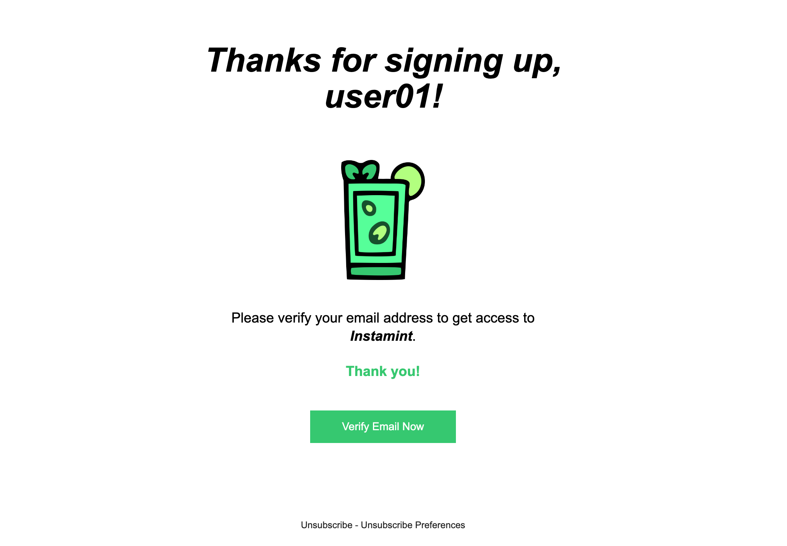

# 🐥 SendGrid Mailing Service

> SendGrid is a cloud-based email service that provides reliable transactional email delivery, scalability, and
> real-time analytics along with flexible APIs that make custom integration easy.

## ⚠️ Requirements

- **SendGrid Account**: You need to have a [SendGrid](https://sendgrid.com/) account to use this service.
- **SendGrid API Key**: You need to have a `SendGrid API key` to use this service.
- **SenGrid Sender Email**: You need to have a `Sender Email` to use this service.
- Install the `@sendgrid/mail` package using `pnpm` or `npm`.

```bash
pnpm i @sendgrid/mail
```

> Setup them on your `.env` file

```env
[...]
SENDGRID_API_KEY=your_sendgrid_api_key
SENDGRID_SENDER=your_sendgrid_sender_email
```

## 📨 Sending Emails

- You can create `templates` on `SendGrid` and use them to send **emails**.

- Example of **sending an email** using `SendGrid`:

```ts
import sgMail from "@sendgrid/mail"

users.post("/", async (c: Context): Promise<Response> => {
  sgMail.setApiKey(yourSendGridAPIkey) // Set the SendGrid API Key

  const sendGridMail: MailBuild<{ username: string; token: string }> = {
    to: email,
    from: yourSendGridSender,
    templateId: "your_sendgrid_template_id",
    dynamic_template_data: { example: "example" }, // Data to be used in the template
  }

  await sgMail.send(sendGridMail) // Send the email

  return [your_response_here]
})
```

### 🚀 Inbox Screen


