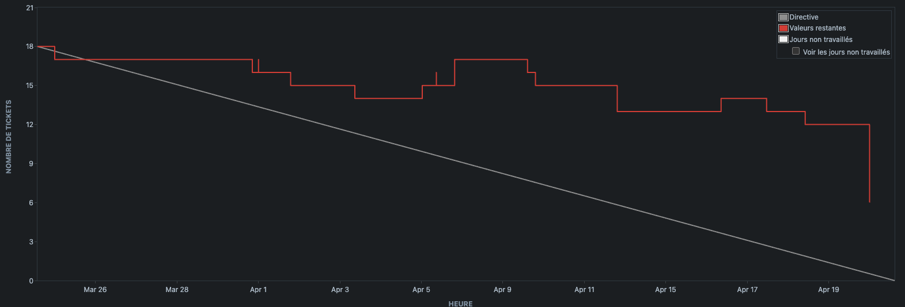

# [Sprint 1](https://project-william.atlassian.net/jira/software/c/projects/ITM/boards/4/reports/sprint-retrospective?sprint=6): `[22/03 - 22/04]`

> In this first sprint dedicated to launching the project, we made good progress on the workspace setup, technical
> conceptualisation (Merise / UML) and documentation.
> Finally, we were able to start work on the features linked to the user account and authentication.

## Positive reviews

- Review1 :

  - Description: `I really appreciated the setting up of this project.`
  - Commitment:
    - Who: `William Wautrin`
    - What: `All the architecture, docker implementation, environments and packages are top quality.`

- Review2 :

  - Description: `I enjoyed the support we got from each other during this sprint.`
  - Commitment:
    - Who: `William Wautrin, Hugo Vaillant, Pascal Lim & Thomas De Oliveira`
    - What: `There was a lot of help, both in the pr review and sometimes in calls or during meetings.`

- Review3 :

  - Description: `I liked the design approach.`
  - Commitment:
    - Who: `Pascal Lim`
    - What: `He's very good at bringing a more up-to-date and accessible vision of design to users.`

- Review4 :

  - Description: `Good rigour on PR reviews between different people.`
  - Commitment:
    - Who: `William Wautrin, Hugo Vaillant, Pascal Lim & Thomas De Oliveira`
    - What: `We were able to review each other's PRs with a lot of rigour and attention to detail.`

- Review5 :
  - Description: `Good communication between the team members & Client.`
  - Commitment:
    - Who: `William Wautrin, Hugo Vaillant, Pascal Lim & Thomas De Oliveira`
    - What: `We were able to communicate well with each other and with the client in order to clear up a few questions about the style / fonts / certain features.`

## Negative reviews

- Review 1

  - Description: `I'm a bit behind on my tickets.`
  - Commitment:
    - Who: `Thomas De Oliveira`
    - What: `I didn't keep up with the group and I fell behind in what I had to do.`

## Questions

We have no further questions, and were able to put them to the customer in good time.

## Ideas

The ideas we had were discussed and implemented in agreement with the client, particularly with regard to account
reactivation and deletion after 6 months.

## Participants

- `William Wautrin`
- `Hugo Vaillant`
- `Pascal Lim`
- `Thomas De Oliveira`

## Burn-down chart

