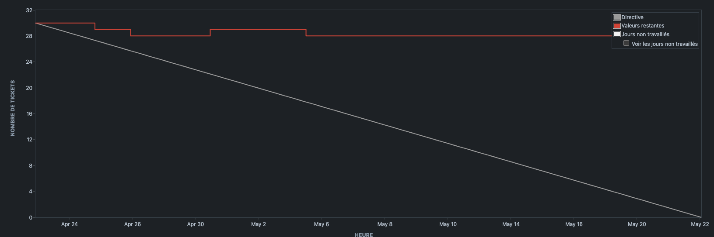

# [Sprint 2](https://project-william.atlassian.net/jira/software/c/projects/ITM/boards/4/reports/sprint-retrospective?sprint=7): `[21/04 - 19/05]`

> In this second sprint the focus was on finishing off the auth with the implementation of the 2FA, the start of the
> admin dashboard, instant messaging and the start of the social features.

## Positive reviews

- Review1 :
  - Description: `Tasks that are blocking the other features have been completed.`
  - Commitment:
    - Who: `William Wautrin`
    - What: `The tasks that were blocking the other features have been completed.`

## Negative reviews

- Review1 :
  - Description: `I'm getting rid of procrastination.`
  - Commitment:
    - Who: `Hugo Vaillant & Thomas De Oliveira`
    - What: `We're not happy with the pace we've set ourselves.`

## Questions

We have no further questions, and were able to put them to the customer in good time.

## Ideas

Nothing to report.

## Participants

- `William Wautrin`
- `Hugo Vaillant`
- `Pascal Lim`
- `Thomas De Oliveira`

## Burn-down chart

