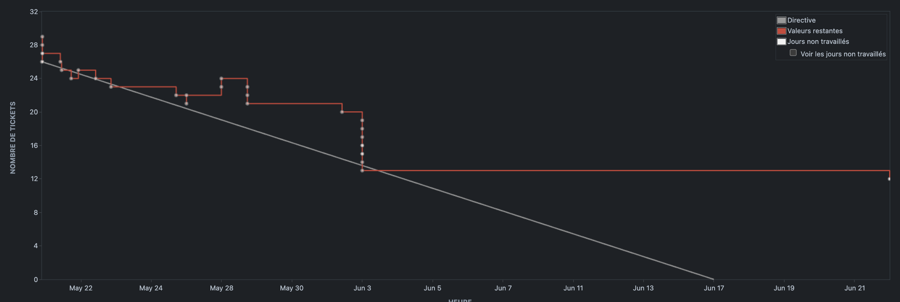

# [Sprint 3](https://project-william.atlassian.net/jira/software/c/projects/ITM/boards/4/reports/sprint-retrospective?sprint=9): `[21/05 - 16/06]`

> In this third and final sprint, we were able to move forward on the very essence of the application, the social
> features that enable
> the publication of NFTs and interaction between users through likes and comments on them.
> We've also worked hard on the user profile & notifications system to offer something intuitive.

## Positive reviews

- Review1 :

  - Description: `We have a project that is functional and ready to use, so I'm happy.`
  - Commitment:
    - Who: `William Wautrin`
    - What: `In this last sprint, we were missing some major features that would allow us to have a complete workflw on our app, and this was well done.`

- Review2 :

  - Description: `Application delivered on time.`
  - Commitment:
    - Who: `William Wautrin, Hugo Vaillant, Pascal Lim & Thomas De Oliveira`
    - What: `We were able to finish the project on time and deliver a functional application.`

## Negative reviews

- Review 1

  - Description: `We've slowed down a bit.`
  - Commitment:
    - Who: `William Wautrin`
    - What: `We've slowed down a bit and that demotivated me a bit in that last sprint. `

## Questions

We have no further questions, and were able to put them to the customer in good time.

## Participants

- `William Wautrin`
- `Hugo Vaillant`
- `Pascal Lim`
- `Thomas De Oliveira`

## Burn-down chart

